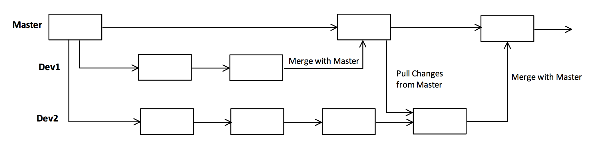
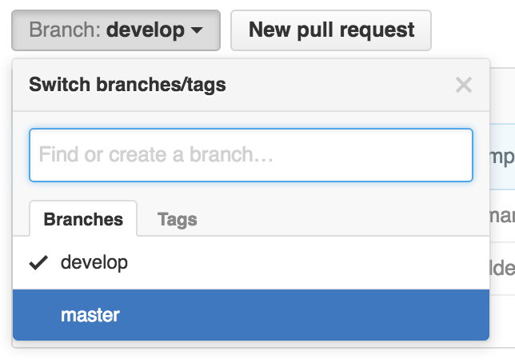
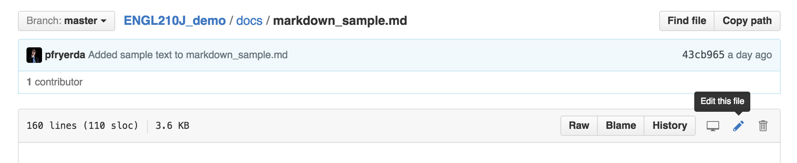
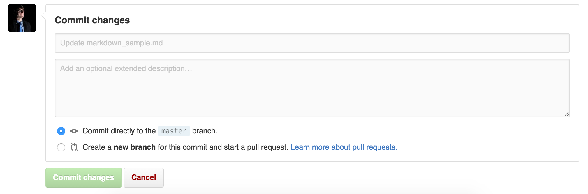
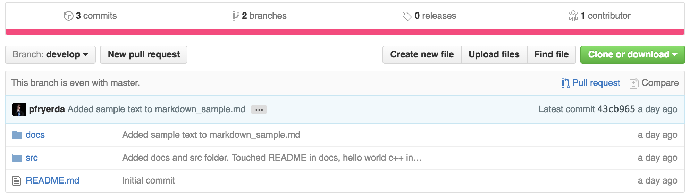
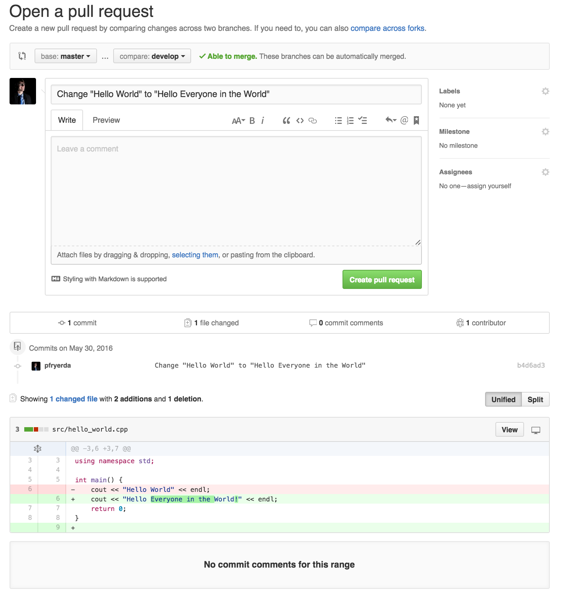

# Git/GitHub

### What is git?

Git is a version control system. Version control is a way to track changes to a document, much like the **"See Revision History"** option in Google Drive. It allows writers, programmers, and designers to keep track of changes to documents and file structures in a way that prevents anything from being deleted.

### GitHub

GitHub is a website that allows its users to access remote repositories. It provides information about your repository, as well as ways to track changes, view branches, and edit/view files.

#### Saving versus Commiting

In Microsoft Word, files are saved to the computer and are stored locally (on the computer's disk/memory) or in the cloud. Every time you press the save button, the file stored on disk is overwritten with the new changes and no version of the old document is left. Git inserts itself into this process. Using a process called **commiting**, git stores a snapshot of all the files in the **repository**. When you save a file, git trackes the changes to the document. When you decide you are ready to upload a new version to the repository, you make a **commit**, which publishes all the changes you have made to each file in the repository, and includes a **message** to indiciate what you did in that commit.

#### Repositories

A **repository** is a folder of everything contained within a project. Git records changes to all files inside a repository. Repositories can be **local** (stored on your computer) or **remote** (stored in the cloud). We will only be looking at remote repositories for this tutorial.

#### Branches

**Branches** are a record of commits that are distinct from one another. They allow multiple people to work on the same file at the same time without being effected by each other's changes. Because git only tracks changes to a file and not the whole file, multiple people can work on the same file at the same time without overwritting each other's work. However, if you are working on one task that requires multiple commits, you don't want other people's commits to affect what you are working on. To keep it simple, branches provide editors the ability to work on their own tasks without feeling the effects of other editors' work. You can see this happening below, where two people are working on seperate tasks on their own branches (Dev1 and Dev2).

If you want to learn more about branching strategies, read [this](http://nvie.com/posts/a-successful-git-branching-model/).

#### Forking

Forking is the way to create a branch. Since no branch can have the same name, forking duplicates the contents and commit history of the current branch and changes its name. Any commits made on this new branch will not be duplicated on the original branch. You can see this effect in the branching shown above.

### GitHub

#### The File Browser

GitHub's primary feature is its file browser. It allows you to view any folder/file in a repository. Clicking on any folder will show you the contents of the folder. Clicking on a file will show you a preview of the file. In order to view the repository from a different branch, you can click the name of the branch, and select the branch you would like to view. Typing a new name into the search bar will **fork** the current branch with the typed name.

#### The Editor

GitHub has a great editing tool that will allow you to edit documents on the fly and commit them to the repository. Each commit can only have changes from a single file, so this isn't always the best solution, but it's better than nothing. When you view a file on GitHub, you can edit it by clicking the button shown below.

This will take you to a new screen which will allow you to change the name of the file and the content, as well as preview the document. Once you are finished making changes, you can commit them by filling out the **"Commit Changes"** form at the bottom of the page. This will also allow you to create a new branch based on your current branch with the applied changes.

#### Pull Requests

Pull requests are the foundation of GitHub. They are the only way (for now) to merge changes on feature branches back into the develop and master branches. They give other people a chance to review all the changes on a branch before it is merged back into the original branch. GitHub makes pull request very simple. When you have decide that your feature branch is ready to be merged back into the original branch that you forked from, you press **"Pull Request"** button.

This will take you to a new screen where you can see all the differences between the original branch and your feature branch. Once you are satisfied with how your commit looks, you can press the green **"Create Pull Request"**. Now, others can review your changes and make comments on individual lines, asking you why you did something the way you did, or pointing out issues in your writting. Once everyone has approved your changes, a manager will merge your code back into the original branch.

#### [Student Developer Pack](https://education.github.com/pack)

While this kit is mainly for developers, there are some great tools for connected writers as well. It's free so long as you are a student, and gives you access to amazing products!

[Check it out!](https://education.github.com/pack)

